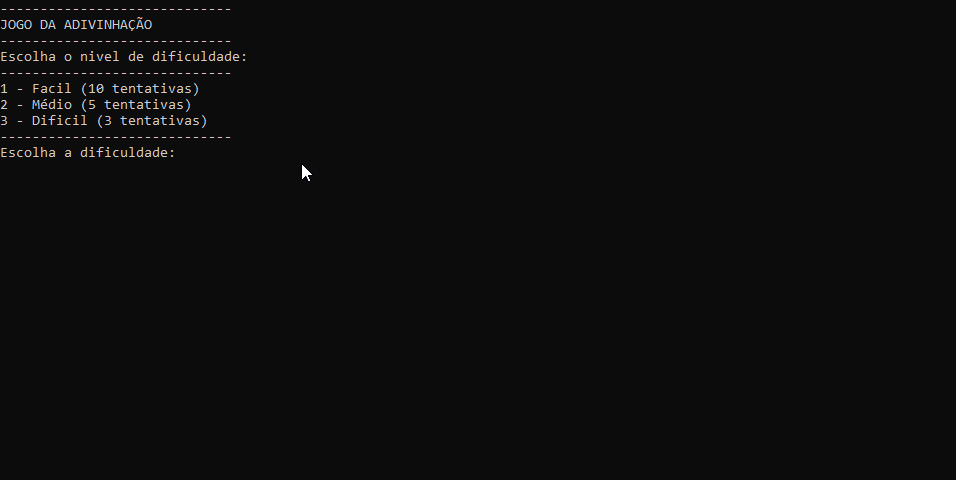

#  JOGO DA ADIVINHAÇÃO



## Introdução

Um jogo de adivinhação onde o usuario escolhe a dificuldade e baseado nela ele terá um numero de tentativas para adivinhar um numero secreto criado pelo programa.

## Funções

**- Niveis de dificuldade:** o usuario pode escolher entre 3 niveis: **FACIL**,**MÉDIO** e **DIFICIL** e então da a ele tanto u m número de tentativas quanto um escopo de numeros que podem ser chutados com base na dificuldade selecionada.

**- Tratamento de exeções:** faz o tratamento tanto para não poder passar um valor invalido na seleção de dificuldade.

**- Geração de número aleatório oculto:** o programa gera um numero aleatório oculto variando entre 1 e 20 para facil,1 e 50 para medio e por fim 1 e 100 para dificil.

**- Sistema de tentativas:** da ao usuario um numero de tentativas para adivinhar o numero oculto com base na dificuldade selecionada,sendo elas: 10 para facil,5 para medio e 3 para dificil,bem como mostra em qual tentativa o usuario esta e faz verificação de valores repetidos para que a tentativa nao seja desperdiçada.

 **- Pontuação:** um sistema de pontuação decrescente onde o usuario começa sempre com 1000 pontos e cada tentativa errada ele perde a quantidade de pontos dependo da diferença entre o numero chutado e o numero secreto: se a **diferença for maior ou igual a 10 perde 100 pontos**,**igual ou maior a 5 perde e 50** e se for **menor ou igual a 3 perde 20**.

## Como ultilizar

1. Extraia o arquivo JogoDaAdivinhacao.ConsoleApp do repositório com .zip;

2. Restaure as dependecias do projeto com o ```comando```:
```
dotnet restore
```
3. Agora va até o diretório raiz e execute no terminal com o ```comando```:
```
dotnet run --project JogoDaAdivinhacao.ConsoleAPP
```

## Requisitos

.NET SDK (versão 10)